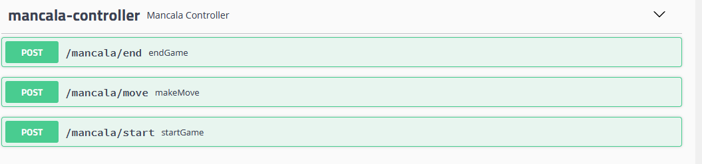

## Technical Information

### Code architecture Backend

**src/main/java/com/game/mancala**

- **config/apidocumentation** - Contains Swagger configuration class for API documentation
- **controller** - Contains all controllers (Our API endpoints). This controllers uses @Service classes located at
  business package
    - **error** - Contains response exception handler and all exception classes for Mancala game api
- **domain/dto** - Contains all objects related to Mancala game project
    - **requests** - Contains request objects for the game API (DTOs)
    - **responses** - Contains response objects for game API (DTOs)
- **mapper** - Contains mappers to build from a DTO request to a DTO response
- **service** - Contains all business logic
- **util** - Contains common resources for this project

**java/resources**

- **application.properties** - Contains all properties for Mancala game app

**src/test/java/com/game/mancala**

- **integration** Contains all the integration tests for the project
- **unit** Contains all the unit tests for the project
- **utils** Contains a helper class for mocking a object

### Code architecture Frontend

**src/main/frontend**

- **public** - Public folder that can be referenced from the index.html where is the page template.
- **src** - Contains all the files related to run the app.
    - **components** - Contains all components necessary in order to render the app.
- **package.json** - Store the metadata associated with the project as well as to store the list of dependency packages.

## Swagger UI

Open Swagger UI

http://localhost:8080/swagger-ui.html

